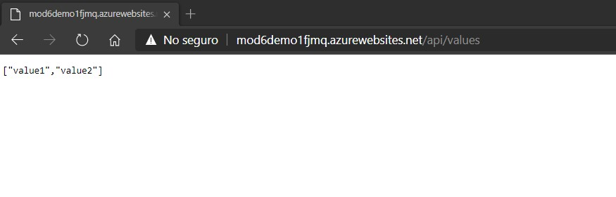

# Module 6: Deploying and Managing Services

# Lesson 1: Web Deployment with Microsoft Visual Studio

### Demonstration: Deploying a Web Application with Visual Studio

- Creamos el proyecto  MyWebSite del tipo  **ASP.NET Core Web API **en VS2019

- Creamos una Web App

  

- Publicamos desde VS2019 a nuestra web app 

  

- probamos **http://[mod6demo1fjmq.azurewebsites.net/api/values](http://mod6demo1fjmq.azurewebsites.net/api/values).** 

  
  
  

  

